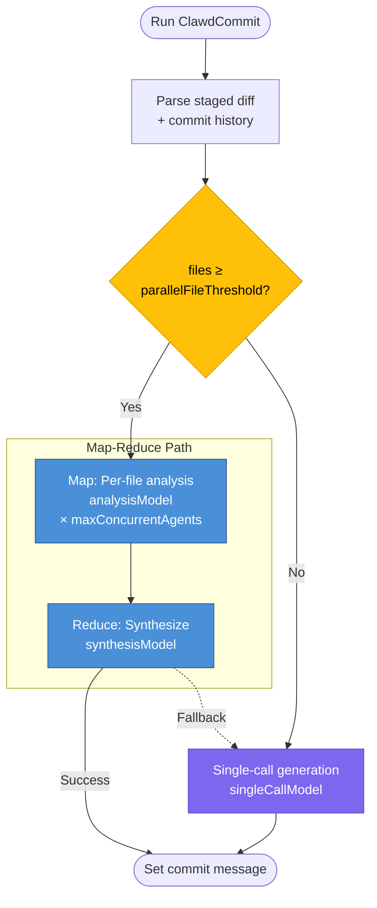

#  ClawdCommit

[](https://marketplace.visualstudio.com/items?itemName=ShiftinBits.clawdcommit) [](https://github.com/shiftinbits/clawdcommit/actions/workflows/test.yml?query=branch%3Amain) [](https://app.codecov.io/gh/shiftinbits/clawdcommit/) [](https://snyk.io/test/github/shiftinbits/clawdcommit) [](LICENSE)

A VS Code extension that generates git commit messages using the [Claude Code CLI](https://docs.anthropic.com/en/docs/claude-code).

Stage your changes, click the button in the source control panel "Changes" bar, and ClawdCommit will draft a commit message based on your staged diff and recent commit history using Claude Code CLI.


## Installation

Click the following install button:

[](vscode:extension/ShiftinBits.clawdcommit)

Or install from the Visual Studio Marketplace:

1. Visit the [ClawdCommit listing in the Visual Studio Marketplace](https://marketplace.visualstudio.com/items?itemName=ShiftinBits.clawdcommit)
2. Click on "Install" button
3. Proceed with the extension installation process

## Prerequisites

- [VS Code](https://code.visualstudio.com/) 1.85+
- [Claude Code CLI](https://docs.anthropic.com/en/docs/claude-code) installed and available on your `PATH`
- A git repository open in VS Code

## Configuration

All settings are available under **Settings > Extensions > ClawdCommit** or via `clawdCommit.*` in `settings.json`.

| Setting | Type | Default | Description |
|---------|------|---------|-------------|
| `clawdCommit.analysisModel` | `haiku` \| `sonnet` \| `opus` | `haiku` | Claude model for per-file analysis (map phase). |
| `clawdCommit.synthesisModel` | `haiku` \| `sonnet` \| `opus` | `sonnet` | Claude model for commit message synthesis (reduce phase). |
| `clawdCommit.singleCallModel` | `haiku` \| `sonnet` \| `opus` | `sonnet` | Claude model for single-call generation (small commits below the parallel threshold). |
| `clawdCommit.parallelFileThreshold` | `number` (2–10) | `4` | Minimum changed files to trigger parallel map-reduce analysis. Fewer files use a single call. |
| `clawdCommit.maxConcurrentAgents` | `number` (1–20) | `5` | Maximum parallel Claude analysis agents. Lower values reduce API load; higher values speed up large commits. |
| `clawdCommit.includeFileContext` | `boolean` | `true` | Include full staged file content alongside the diff for richer analysis. Disable to reduce token usage. |

### How it works

For small commits (fewer files than `parallelFileThreshold`), ClawdCommit sends a single request to Claude using the `singleCallModel`.

For larger commits, it uses a **map-reduce** strategy:

1. **Map** — Each changed file is analyzed in parallel by an agent using the `analysisModel` (bounded by `maxConcurrentAgents`).
2. **Reduce** — A synthesis agent combines all per-file analyses into a final commit message using the `synthesisModel`.

If the map-reduce path fails, it automatically falls back to the single-call approach.



## Running locally

1. Clone the repo and install dependencies:

   ```sh
   git clone <repo-url>
   cd ClawdCommit
   npm install
   ```

2. Open the project in VS Code.

3. Press **F5** (or **Run > Start Debugging**). This launches a new Extension Development Host window with the extension loaded.

4. In the Extension Development Host, open a git repository, stage some changes, and click the ClawdCommit icon in the Source Control title bar.

### Development build

```sh
npm run compile
```

This type-checks with `tsc` then bundles with esbuild into `dist/extension.js`.

### Packaging as a `.vsix`

```sh
npx @vscode/vsce package
```

This produces a `.vsix` file you can install in VS Code via **Extensions > Install from VSIX...**.

## License

MIT — see [LICENSE](./LICENSE).
