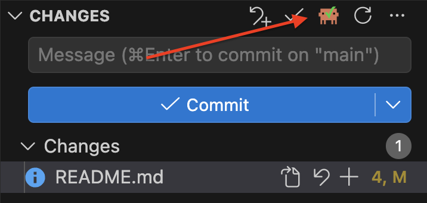

#  ClawdCommit

[](https://marketplace.visualstudio.com/items?itemName=ShiftinBits.clawdcommit) [](https://github.com/shiftinbits/clawdcommit/actions/workflows/test.yml?query=branch%3Amain) [](https://app.codecov.io/gh/shiftinbits/clawdcommit/) [](https://snyk.io/test/github/shiftinbits/clawdcommit) [](LICENSE)

A VS Code extension that generates git commit messages using the [Claude Code CLI](https://docs.anthropic.com/en/docs/claude-code).

Stage your changes, click the ClawdCommit button in the Source Control title bar (or press `Ctrl+Shift+Alt+C` / `Cmd+Shift+Alt+C` on macOS), and ClawdCommit will draft a commit message based on your staged diff and recent commit history.



## Installation

1. Visit the [ClawdCommit listing in the Visual Studio Marketplace](https://marketplace.visualstudio.com/items?itemName=ShiftinBits.clawdcommit)
2. Click on "Install" button
3. Proceed with the extension installation process

## Prerequisites

- [VS Code](https://code.visualstudio.com/) 1.109+
- A git repository open in a [trusted workspace](https://code.visualstudio.com/docs/editing/workspaces/workspace-trust) (the extension is disabled in Restricted Mode)
- **Desktop:** [Claude Code CLI](https://docs.anthropic.com/en/docs/claude-code) installed and available on your `PATH`
- **VS Code for the Web** (vscode.dev, github.dev): a Claude model available through the VS Code Language Model API, e.g. via GitHub Copilot or Bring Your Own Key

## Configuration

All settings are available under **Settings > Extensions > ClawdCommit** or via `clawdCommit.*` in `settings.json`.

| Setting | Type | Default | Description |
|---------|------|---------|-------------|
| `clawdCommit.model` | `haiku` \| `sonnet` \| `opus` | `sonnet` | Claude model to use for commit message generation. |
| `clawdCommit.includeFileContext` | `boolean` | `true` | Allow Claude to read files in the working directory for additional context beyond the diff. Disable to restrict analysis to the staged diff only. |

On the web, `clawdCommit.model` selects the matching `claude-<model>` family from the Language Model API; if it isn't available, the first available Anthropic model is used and a warning is shown. `clawdCommit.includeFileContext` applies to the desktop (CLI) only.

### How it works

When you trigger ClawdCommit, it reads your staged diff and the last 5 commits, and sends them to Claude in a single request. On desktop, when `includeFileContext` is enabled, Claude may also read files in the repository to better understand the change. Claude generates a commit message matching your project's style and places it in the Source Control commit input box.

In multi-repo workspaces, clicking the button in a repository's Source Control title bar generates a message for that repository. When triggered from the keyboard or Command Palette, ClawdCommit uses the repository containing the active editor's file, falling back to the first repository.

## Running locally

1. Clone the repo and install dependencies:

   ```sh
   git clone https://github.com/shiftinbits/clawdcommit.git
   cd clawdcommit
   npm install
   ```

2. Open the project in VS Code.

3. Press **F5** (or **Run > Start Debugging**). This launches a new Extension Development Host window with the extension loaded.

4. In the Extension Development Host, open a git repository, stage some changes, and click the ClawdCommit icon in the Source Control title bar.

### Development build

```sh
npm run compile
```

This type-checks with `tsc` then bundles with esbuild into `dist/extension.js` (desktop) and `dist/web/extension.js` (web).

### Running tests

```sh
npm test
npm run test:coverage
```

### Packaging as a `.vsix`

```sh
npx @vscode/vsce package
```

This produces a `.vsix` file you can install in VS Code via **Extensions > Install from VSIX...**.

## License

MIT — see [LICENSE](./LICENSE).
